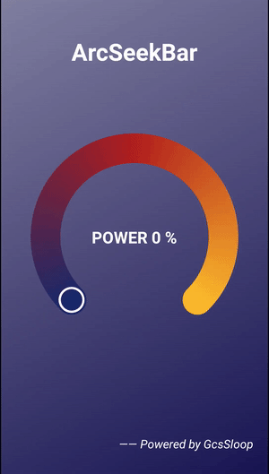
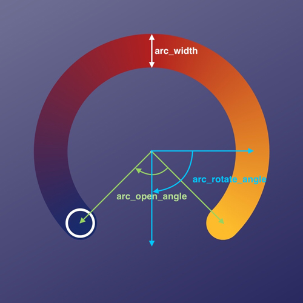
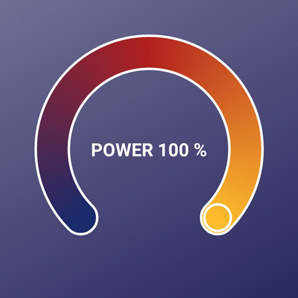

# ArcSeekBar(圆弧拖动条)

这个是在公司项目中准备使用的一个控件，本准备直接在网上搜一个用，可惜找到的很多都是 ProgressBar，并不具备拖拽功能，于是自己动手实现了一个，其功能和特性均仿照 SeekBar 进行设计。

## 效果预览



## 支持的特性

- [x] 进度功能。
- [x] 自定义属性配置。
- [x] 线条宽度。
- [x] 开口角度。
- [x] 旋转角度。
- [x] 渐变色。
- [x] 最大进度值。
- [x] 拖动按钮颜色、大小、样式(填充、描边、填充+描边)。
- [x] 状态变化回调。

## 主要文件

| 名字       | 摘要              |
| ---------- | ----------------- |
| ArcSeekBar | 圆弧形状SeekBar。 |

### 1. 基本用法

```xml
<com.gcssloop.widget.ArcSeekBar
    android:id="@+id/arc_seek_bar"
    android:layout_width="280dp"
    android:layout_height="280dp"
    app:arc_colors="@array/arc_colors_default"
    app:arc_max="100"
    app:arc_open_angle="90"
    app:arc_progress="0"
    app:arc_rotate_angle="90"
    app:arc_thumb_color="#fff"
    app:arc_thumb_mode="STROKE"
    app:arc_thumb_radius="16dp"
    app:arc_thumb_width="3dp"
    app:arc_width="40dp"/>
```

### 2. 配置属性

可以在布局文件中配置的基本属性如下：

| 属性名称         | 摘要                                    | 是否必须设置 | 类型  |
| ---------------- | --------------------------------------- | ------------ | ----- |
| arc_width        | 圆弧的宽度                              | 否           | dp    |
| arc_open_angle   | 圆弧开口的角度                          | 否           | int   |
| arc_rotate_angle | 旋转角度，默认90                        | 否           | int   |
| arc_colors       | 圆弧渐变色                              | 否           | array |
| arc_max          | 进度最大数值                            | 否           | int   |
| arc_progress     | 默认进度                                | 否           | int   |
| arc_thumb_width  | 拖动按钮描边宽度                        | 否           | dp    |
| arc_thumb_color  | 拖动按钮颜色                            | 否           | color |
| arc_thumb_radius | 拖动按钮半径                            | 否           | dp    |
| arc_thumb_mode   | 拖动按钮模式(FILL、STROKE、FILL_STROKE) | 否           | emnu  |
| arc_border_width | 描边宽度，默认为 0，即不显示。          | 否           | dp    |
| arc_border_color | 描边颜色，默认为白色。                  | 否           | color |

### 3. 属性简介

#### 3.1 基本绘制属性



进度条宽度(arc_width)、开口角度(arc_open_angle)、旋转角度(arc_rotate_angle) 的基本含义如上图所示。

**进度条宽度(arc_width)：** 进度条宽度是上图白色部分所示的内容，是控制绘制宽窄的。  
**开口角度(arc_open_angle)：** 开口角度是上图中下方没有进度显示的部分，如果开口角度为 0 则绘制出来是一个圆。如果开口角度为 180 度，则为一个半圆。  
**旋转角度：**  旋转角度是圆环开口的最终指向，该数值默认为 90 度。  

#### 3.2 渐变色

渐变色如上图所展示的那样，允许指定大于等于两种以上的颜色进行渲染，基本使用如下.

**1. 在 /res/values 里面定义一个 array 数组，其条目为一系列颜色(颜色数量大于等于2)。**

```xml
<?xml version="1.0" encoding="utf-8"?>
<resources>
    <array name="arc_colors_default">
        <item>#1a2a6c</item>
        <item>#b21f1f</item>
        <item>#fdbb2d</item>
    </array>
</resources>
```

**2. 引用指定颜色**

```xml
<com.gcssloop.widget.ArcSeekBar
    android:layout_width="280dp"
    android:layout_height="280dp"
    app:arc_colors="@array/arc_colors_default"/>
```

> **注意： 所指定的颜色数组数量必须大于 2，如果想要使用纯色，则直接将两个array条目设置为同一种颜色即可。**

#### 3.3 进度属性

进度属性有两个， `arc_max` 指定最大数值， `arc_progress` 指定默认的进度。

#### 3.4 拖动按钮属性

拖动按钮即上方演示图中的圆环，
**arc_thumb_width：**指定圆环宽度。  
**arc_thumb_color：** 指定按钮颜色。  
**arc_thumb_radius：** 指定按钮半径。  
**arc_thumb_mode：** 指定按钮绘制模式，默认为 STROKE(描边)，可以指定 FILL、STROKE、FILL_STROKE。

#### 3.5 描边

v1.1.0 以上版本支持。

可以实现描边效果，具体看图。



### 4.添加方法

#### 4.1 添加仓库

在项目的 `build.gradle` 文件中配置仓库地址。

```groovy
allprojects {
    repositories {
        jcenter()
        // 私有仓库地址
       maven { url "http://lib.gcssloop.com:8081/repository/gcssloop-central/" }
    }
}
```

#### 4.2 添加项目依赖

在需要添加依赖的 Module 下添加以下信息，使用方式和普通的远程仓库一样。

```groovy
implementation 'com.gcssloop.widget:arc-seekbar:1.0.0'
```

## 作者简介

#### 作者微博: [@GcsSloop](http://weibo.com/GcsSloop)

#### 个人网站: http://www.gcssloop.com

<a href="http://www.gcssloop.com/info/about/" target="_blank">  </a>

## 更新日志

#### v1.1.0

1. 完善 onMeasure。
2. 添加描边(border)属性。

#### v1.0.0

1. 完成基本的 ArcSeekBar 功能与相关的自定义属性。

## 版权信息

```
Copyright (c) 2018 GcsSloop

Licensed under the Apache License, Version 2.0 (the "License");
you may not use this file except in compliance with the License.
You may obtain a copy of the License at

    http://www.apache.org/licenses/LICENSE-2.0

Unless required by applicable law or agreed to in writing, software
distributed under the License is distributed on an "AS IS" BASIS,
WITHOUT WARRANTIES OR CONDITIONS OF ANY KIND, either express or implied.
See the License for the specific language governing permissions and
limitations under the License.
```
